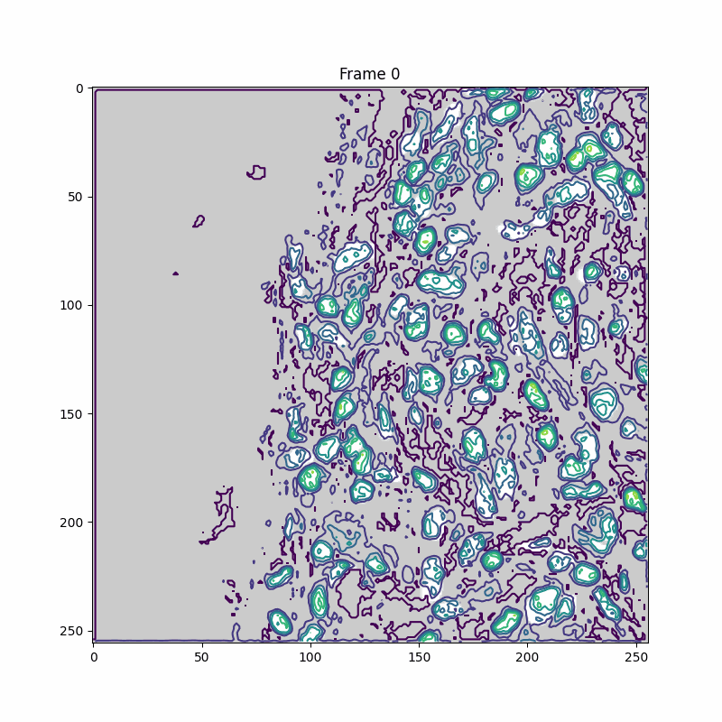
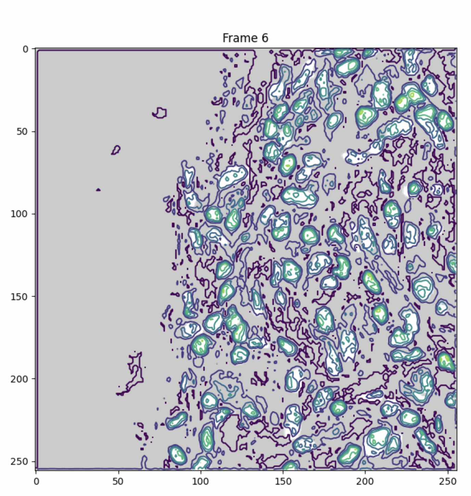
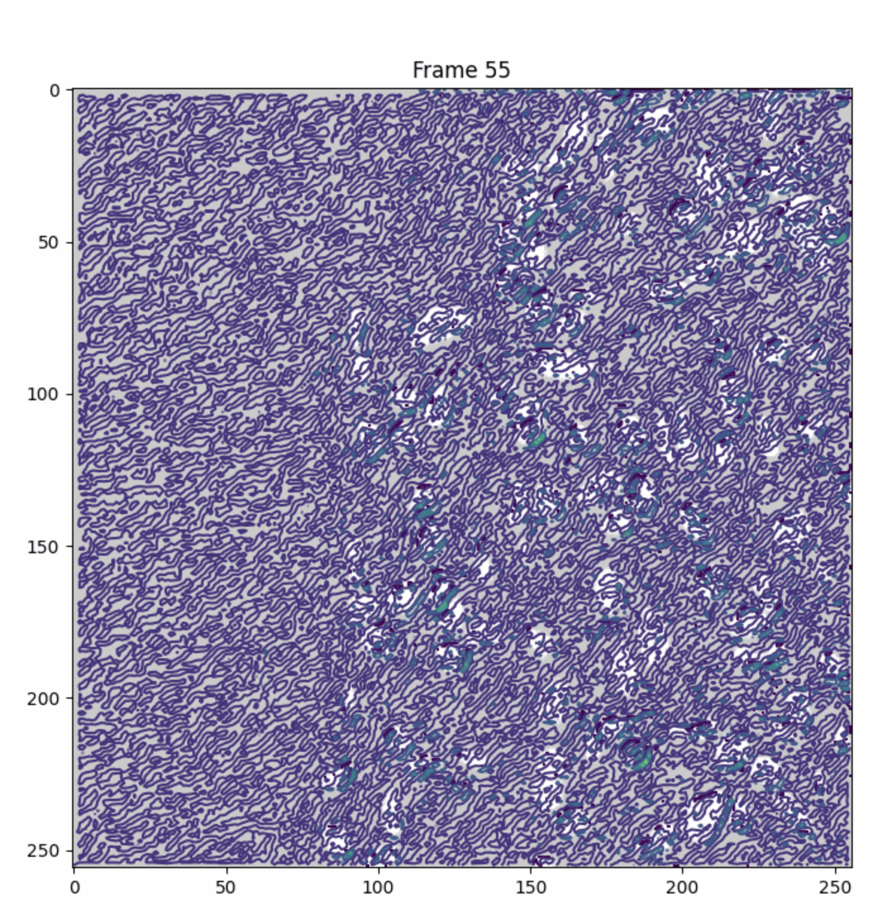
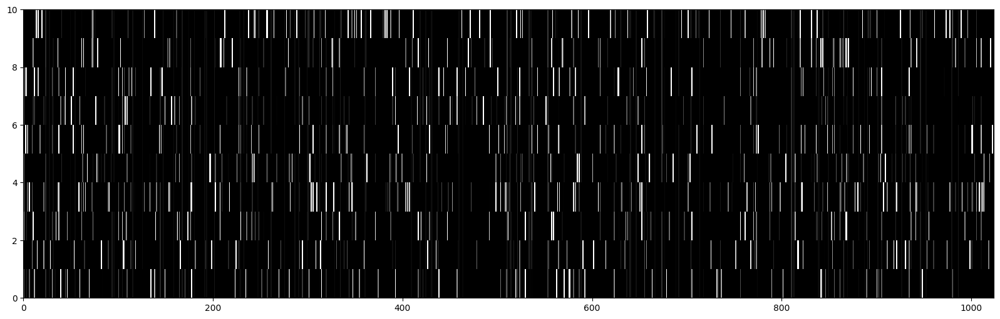
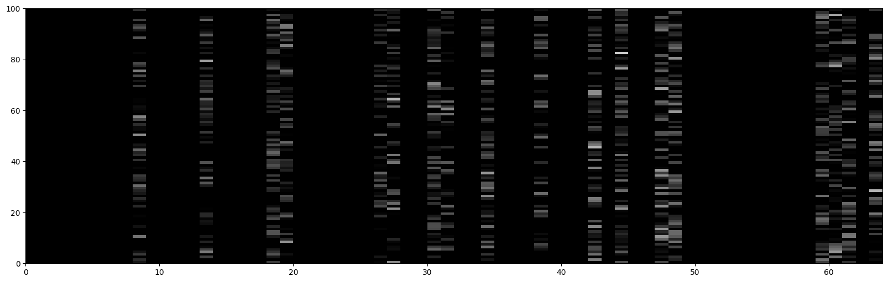

# Is pruning worth it ?

This project visualizes the feature activations of convolutional features in a UNET decoder layer, comparing the activations before and after pruning.

## Visualizations

### Feature Activation Animations

**Unpruned Activations**
Feature activation of all 64 convolutional feature slices of a particular UNET decoder layer before pruning.

**Pruned Activations**
Feature activation of all 64 convolutional feature slices of a particular UNET decoder layer after pruning.

### Convolutional Slice Examples

**Informative Slice**
An example of an informative convolutional slice.

**Non-Informative Slice**
An example of a non-informative convolutional slice (low variance).

### Neuron Activations

The following images show neuron activations from different layers.

*   y-axis: samples
*   x-axis: feature index
*   Whiter color means distant from 0.
*   Black color means 0.

**Conv-Next Layer Activations**

**Last Layer Activations**

## Notebooks

For a detailed walkthrough of the code and experiments, please see the Jupyter notebooks in the `notebooks/` directory.

## Status

Refactored codes are in progress.